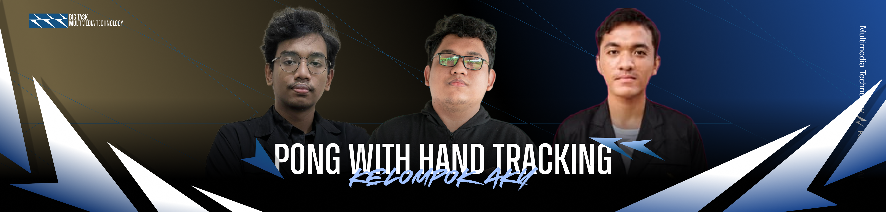
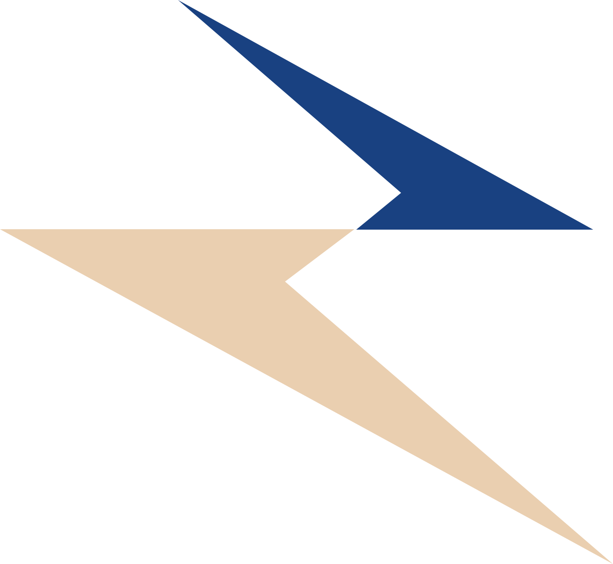
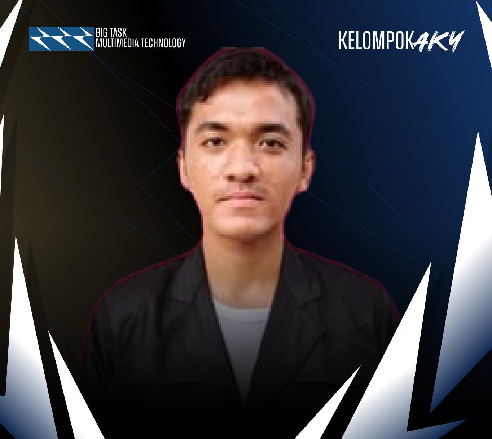

<h1> Pong With Hand Tracking </h1>

##  **Table Of Contents**
[Introduction]()

[Member Of Team]()

[Role & Position Member Of Team]()

[Installation Steps]()

[Documentation]()

[Discussion Analysis]()

[Presentation Video]()

##  **Introduction**
This project combines the concept of the classic game Pong with motion tracking technology. In this program, the user moves the paddle by utilizing hand movements detected through a webcam camera. This project uses MediaPipe to detect the position of the user's fingers in real-time, and Pygame to display game elements such as the ball, paddle, and score on the screen.

##  **Member Of Team**
| [ <b>Ardoni Yeriko</b>](https://github.com/Ardoni121140141)  121140141   | [ <b>Kevin Simorangkir</b>](https://github.com/kevinsimorangkir21) 121140150   | [ <b>Rizki Alfaina</b>](https://github.com/RizkiAlfaina)   12140228   |
|--|--|--|

##  **ID & Position Member Of Team**

| Name | ID Student | Class | Major
| :---: | :---: | :---: | :---: |
| Ardoni Yeriko Rifana Gultom     | 121140141 | R | Informatics Engineering
| Kevin Simorangkir               | 121140150 | R | Informatics Engineering
| M. Rizki Alfaina                | 121140228 | R | Informatics Engineering
</div\>