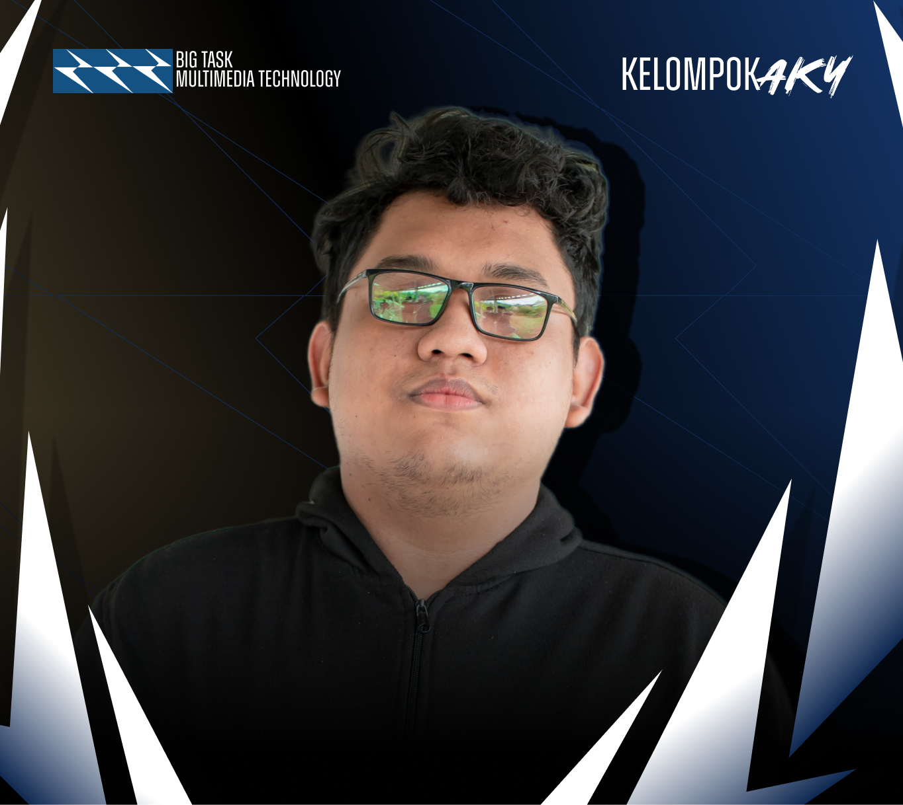

<div align="center">

<h1> Pong With Hand Tracking </h1>

[](#)
[](#)
</div>

##  **Table Of Contents**
[Introduction]()

[Member Of Team]()

[Role & Position Member Of Team]()

[Technology Application]()

[Installation Steps]()

[Documentation]()

[Discussion Analysis]()

[Presentation Video]()

##  **Introduction**
This project combines the concept of the classic game Pong with motion tracking technology. In this program, the user moves the paddle by utilizing hand movements detected through a webcam camera. This project uses MediaPipe to detect the position of the user's fingers in real-time, and Pygame to display game elements such as the ball, paddle, and score on the screen.

##  **Member Of Team**
| [<br /><sub><b>Ardoni Yeriko</b></sub>](https://github.com/Ardoni121140141)<br /> 121140141 <br /> | [<br /><sub><b>Kevin Simorangkir</b></sub>](https://github.com/kevinsimorangkir21)<br />121140150 <br /> | [<br /><sub><b>Rizki Alfaina</b></sub>](https://github.com/RizkiAlfaina) <br/> 12140228 <br /> |
|--|--|--|

##  **ID & Position Member Of Team**
<div align="left">

| Name | ID Student | Class | Major
| :---: | :---: | :---: | :---: |
| Ardoni Yeriko Rifana Gultom     | 121140141 | R | Informatics Engineering
| Kevin Simorangkir               | 121140150 | R | Informatics Engineering
| M. Rizki Alfaina                | 121140228 | R | Informatics Engineering

</div>

##  **Technology Application**
<div align="left">

| Technology | Name | Description |
| :---: | :---: | :---: |
|  | **Python** | Python is an interpreted, high-level and general-purpose programming language. Python's design philosophy emphasizes code readability with its notable use of significant whitespace. |
|  | **Pygame** | Pygame is a cross-platform set of Python modules designed for writing video games. It includes computer graphics and sound libraries designed to be used with the Python programming language. |
|  | **MediaPipe** | MediaPipe is a cross-platform framework for building multimodal applied machine learning pipelines. MediaPipe is used for object detection, face detection, hand tracking, and pose detection. |

</div>

##  **Installation Steps**
###  **Preparation of Needs**
Some of the preparations needed to carry out this research project are as follows:

<li> Install python software/code first </li>

```bash
https://www.python.org/downloads/
```

<li> After installing, first check whether Python has been installed properly using the following command: </li>

```bash
python --version
```

<li> Once the python version appears, please open a text editor that supports it such as Visual Studio Code and the web-based Google Collab. Here are the links to use both (please download and install) :</li>

```bash
[Software VISUAL STUDIO CODE](https://code.visualstudio.com/)
```

```bash
[Software GOOGLE COLLAB](https://colab.research.google.com/)
```